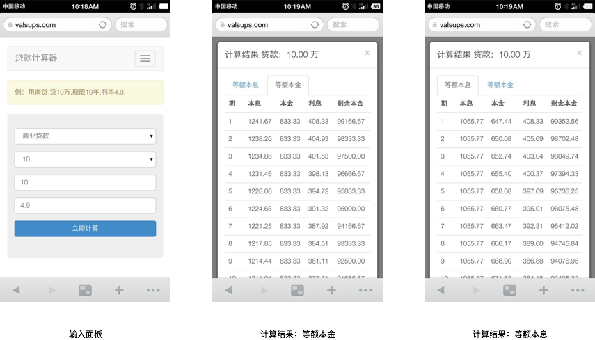

# 贷款计算器

**Valsups** 贷款计算器基于PHP开发，使用了江边望海团队开发的贷款计算器包 [Bankloan](https://packagist.org/packages/jiangbianwanghai/bankloan) ，应该算是 Bankloan 移动端演示项目。

Valsups 贷款计算器有以下特性

- 体积非常小
- 无需安装，直接可以使用
- 支持商业贷款、公积金贷款、组合贷款计算（后续版本中会实现）

## 已发布版本

### v1.0.0-160922

#### 功能：

- 商业贷款计算
- 输出 **等额本息** 和 **等额本金** 计算结果
- 交互使用了 Bootsrap
- 后端程序使用了 Lumen

#### 截图：

## 协议

本项目适用于 LGPL 协议。
